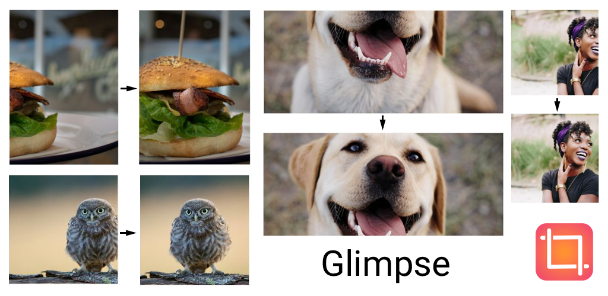

# Glimpse

A content-aware cropping library for Android.

Give the right first impression with just a glimpse! Instead of center cropping images blindly, leverage Glimpse's eye to catch the right spot.



## Setup
Add to top level *gradle.build* file
```gradle
allprojects {
    repositories {
        maven { url "https://jitpack.io" }
    }
}
```

Add to app module *gradle.build* file
TensorFlow lite recommends most developers omit the x86, x86_64, and arm32 ABIs. This can be achieved with the following Gradle configuration, which specifically includes only armeabi-v7a and arm64-v8a, which should cover most modern Android devices.
```gradle

android {
    aaptOptions {
        noCompress "tflite"
        noCompress "lite"
    }
    defaultConfig {
        ndk {
            abiFilters 'armeabi-v7a', 'arm64-v8a'
        }
    }
}

dependencies {
    implementation 'com.github.the-super-toys.glimpse-android:glimpse-core:0.0.5'
    
    //only required for glide extensions
    implementation 'com.github.the-super-toys.glimpse-android:glimpse-glide:0.0.5'
    
    /only required for coil extensions
    implementation 'com.github.the-super-toys.glimpse-android:glimpse-coil:0.0.5'
    
    implementation 'org.tensorflow:tensorflow-lite:0.0.0-nightly'
}
```

## Usage

### Init Glimpse in your Android app

```kotlin
class YourApp : Application() {
    override fun onCreate() {
        super.onCreate()
        Glimpse.init(this)
    }
}
```

### Use Glimpse without extensions
First compute image's focal points by calling `Bitmap.findCenter` extension function.

```kotlin
val original = (imageView.drawable as BitmapDrawable).bitmap
val (x, y) = original.findCenter()
```

Then supply those focal points alongside with the width and height values of the target `ImageView` to `Bitmap.crop` extension function.

```kotlin
val cropped = original.crop(x, y, imageView.layoutParams.width, imageView.layoutParams.height)
imageView.setImageBitmap(cropped)
```

### Use Glimpse with Glide extension 
If you are using [Glide](https://github.com/bumptech/glide) for image loading you can just add `GlimpseTransformation` to `GlideRequest` builder:

 
```kotlin
GlideApp.with(context)
                .load(url)
                .diskCacheStrategy(DiskCacheStrategy.RESOURCE)
                .transform(GlimpseTransformation())
                .into(imageView)
```

It is recommended to set `diskCacheStrategy(DiskCacheStrategy.RESOURCE)` to cache the cropped bitmap by Glimpse, otherwise focal points will be calculated every time the image is displayed.


### Use Glimpse with Coil extension 
If you are using [Coil](https://github.com/coil-kt/coil) for image loading you can just add `GlimpseTransformation` to Coil's `LoadRequestBuilder` builder:

 
```kotlin
imageView.load(url) {
    crossfade(true)
    placeholder(R.drawable.image)
    transformations(GlimpseTransformation())
}


```

### What about other image loaders such as Picasso and Fresco?

We tried to ship Glimpse with both Picasso and Fresco extensions but we were not able to find the right api.

We opened an [issue on Picasso repository](https://github.com/square/picasso/issues/2067) and a [labeled Fresco question on Stack Overflow](https://stackoverflow.com/questions/54773198/fresco-how-to-use-scaletypes-focuscrop-based-on-bitmap-content)  asking for guidance, but sadly we did not find much support. If you know how to assemble Glimpse cropping functionality to either lib without disrupting their original pipeline, please open an issue to review together the proposal. We really want to offer support for all the popular loading image libraries!  
  
### Java callers
If you're using Java you can take a look at this [file](https://github.com/the-super-toys/glimpse-android/blob/master/sample-app/src/main/java/glimpse/sample/TestingApiFromJava.java) to see how Glimpse api looks for Java callers. 

## Sample app
`:sample-app` module showcase Glimpse usage by making use of Glide extensions. The application is also published on [Google Play](https://play.google.com/store/apps/details?id=glimpse.sample). 


## Is Glimpse ready for production? 

Actually, it depends. Ideally you should not use Glimpse to crop the same image over and over. Even if you use Glide extension which caches the output transformation, the underlying calculation 
will be performed in every android client. Thus, if possible, send to your cloud solution the x and y focal points of the calculated crop alongside the image when user uploads content.

We timed the crop calculation on an OnePlus 6 and in average it takes 30 milliseconds. Depending on the device and your specific use case Glimpse may or may not be ready for production. In any case we encourage you to provide feedback to help us make Glimpse a mature library.


## How much increase APK's size?

If you're already using [TensorFlow lite](https://www.tensorflow.org/lite) in your app, adding Glimpse costs only the size of the model, which is 148 KB. But chances are that you are not using it, so you have to take into account also the size of [TensorFlow lite](https://www.tensorflow.org/lite/overview#tensorflow_lite_highlights), which is about 300 KB.


## Let's go DEEPER (The Deep Learning Model)

If you want to know how Glimpse works in a more deeper lever, take a look at [this repository](https://github.com/the-super-toys/glimpse-models), where you can see the architecture and implementation of the Deep Learning model used by Glimpse. We explain how everything works in a much more technical level, and with all details, so you can reproduce it on your own, and improve it if you want.  

But if you do, don't hesitate to submit a Pull Request to that repository so we can keep improving Glimpse!!
